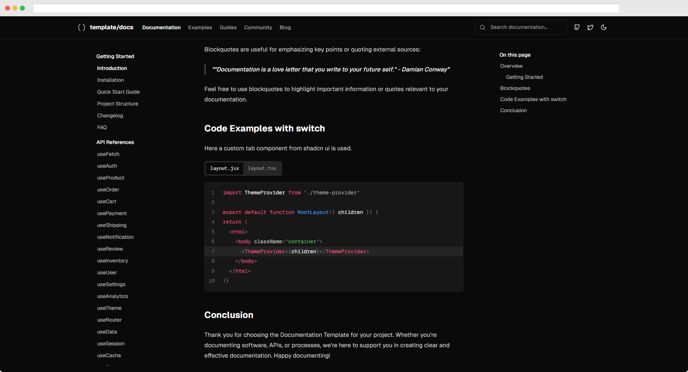
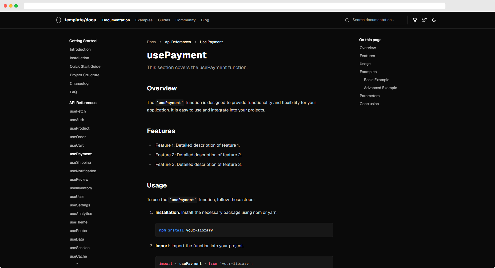
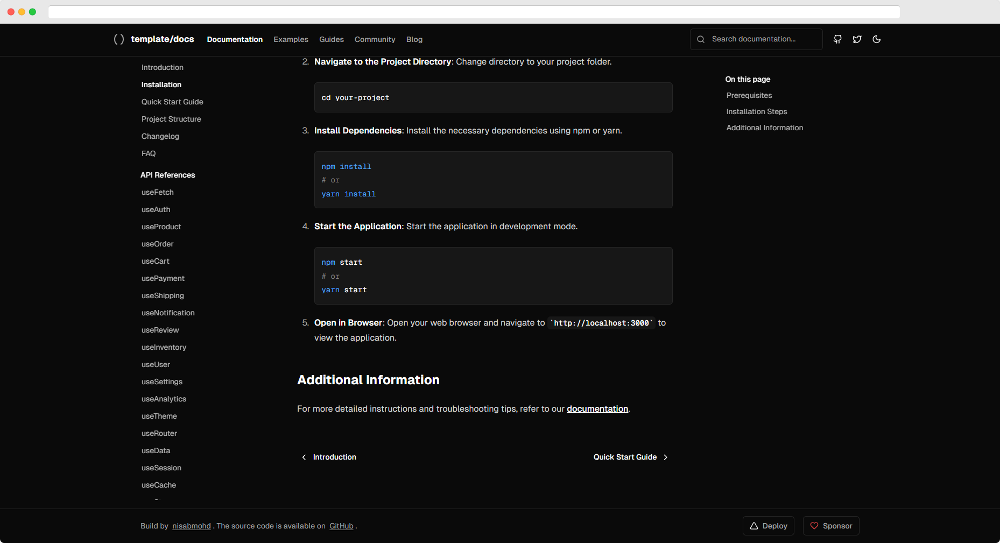
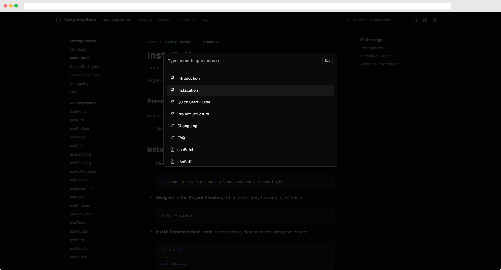

## Documentation Template

This feature-packed documentation template, built with Next.js, offers a sleek and responsive design, perfect for all your project documentation needs.

<br/>

This is a [Next.js](https://nextjs.org/) project bootstrapped with [`create-next-app`](https://github.com/vercel/next.js/tree/canary/packages/create-next-app).

## Getting Started

First, run the development server:

```bash
npm run dev
# or
yarn dev
# or
pnpm dev
# or
bun dev
```

Open [http://localhost:3000](http://localhost:3000) with your browser to see the result.

You can start editing the page by modifying `app/page.tsx`. The page auto-updates as you edit the file.

This project uses [`next/font`](https://nextjs.org/docs/basic-features/font-optimization) to automatically optimize and load Inter, a custom Google Font.

## Learn More

To learn more about Next.js, take a look at the following resources:

- [Next.js Documentation](https://nextjs.org/docs) - learn about Next.js features and API.
- [Learn Next.js](https://nextjs.org/learn) - an interactive Next.js tutorial.

You can check out [the Next.js GitHub repository](https://github.com/vercel/next.js/) - your feedback and contributions are welcome!

## Deploy on Vercel

The easiest way to deploy your Next.js app is to use the [Vercel Platform](https://vercel.com/new?utm_medium=default-template&filter=next.js&utm_source=create-next-app&utm_campaign=create-next-app-readme) from the creators of Next.js.

Check out our [Next.js deployment documentation](https://nextjs.org/docs/deployment) for more details.

[](https://vercel.com/new/clone?repository-url=https://github.com/nisabmohd/Documentation-Template)

## Features

- MDX supported
- Syntax highlighting
- Table of contents
- Pagination
- Search
- Code line highlight & code title
- Static site generation
- Custom components
- Light mode & dark mode
- Code Switcher
- Code copy
- Table of content observer highlight








<h1 align="center">Tech Interview Guru</h1>


## What is this?

Not everyone has the time to do a few hundred LeetCode questions. Here are _free and curated_ technical interview preparation materials for busy engineers, brought to you by me, the author of [Blind 75](https://www.teamblind.com/post/New-Year-Gift---Curated-List-of-Top-75-LeetCode-Questions-to-Save-Your-Time-OaM1orEU). Over 500,000 people have benefitted from this handbook!

Besides the usual algorithm questions, other **awesome** stuff includes:

- [Best practice questions](https://www.techinterviewhandbook.org/coding-interview-study-plan/) for coding interviews
- [Grind 75](https://www.techinterviewhandbook.org/grind75) - the next evolution of Blind 75, bigger and better
- [How to prepare](https://www.techinterviewhandbook.org/coding-interview-prep/) for coding interviews
- [Coding interview best practices](https://www.techinterviewhandbook.org/coding-interview-cheatsheet/) - Straight-to-the-point Do's and Don'ts
- [Algorithm cheatsheets and tips](https://www.techinterviewhandbook.org/algorithms/study-cheatsheet/) categorized by topic
- [Step-by-step Software Engineer resume guide](https://www.techinterviewhandbook.org/resume/) to prepare a FAANG-ready resume
- [Behavioral questions](https://www.techinterviewhandbook.org/behavioral-interview-questions/) asked by the top tech companies
- [Front end interview preparation](https://www.frontendinterviewhandbook.com)

Help from you in contributing content would be very much appreciated!

## Why would you read this?

This repository has **practical** content that covers all phases of a technical interview, from applying for a job to passing the interviews to offer negotiation. Technically competent candidates might still find the non-technical content helpful.

The information in this repository is condensed. Ultimately, the key to succeeding in technical interviews is consistent practice and I don't want to bore you with too many words. I tell you the minimum you need to know on how to go about navigating the interview process, you go and practice and land your dream job.

## Who is this for?

Anybody who wants to land a job at a tech company but is new to technical interviews, seasoned engineers who have not been on the other side of the interviewing table in a while and want to get back into the game, or anyone who wants to be better at technical interviewing.


## How is this repository different?

There are many awesome books like "Cracking the Coding Interview" and interview-related repositories out there on GitHub, what makes this repository different? The difference is that many existing interview repositories contain mainly links to external resources whereas this repository contains top-quality curated content directly for your consumption.

Also, existing resources focus mainly on algorithm questions and lack coverage for more domain-specific and non-technical questions. This handbook aims to cover content beyond the typical algorithmic coding questions. 😎

## Looking for interview courses?

### [AlgoMonster](https://shareasale.com/r.cfm?b=1873647&u=3114753&m=114505&urllink=&afftrack=)

AlgoMonster aims to help you ace the technical interview **in the shortest time possible**. By Google engineers, AlgoMonster uses a data-driven approach to teach you the most useful key question patterns and has contents to help you quickly revise basic data structures and algorithms. Best of all, AlgoMonster is not subscription-based - pay a one-time fee and get **lifetime access**. [**Join today for a 70% discount →**](https://shareasale.com/r.cfm?b=1873647&u=3114753&m=114505&urllink=&afftrack=)

### [Grokking the Coding Interview: Patterns for Coding Questions](https://designgurus.org/link/kJSIoU?url=https%3A%2F%2Fdesigngurus.org%2Fcourse%3Fcourseid%3Dgrokking-the-coding-interview)

This course by Design Gurus expands upon the questions on the recommended practice questions but approaches the practicing from a questions pattern perspective, which is an approach I also agree with for learning and have personally used to get better at coding interviews. The course allows you to practice selected questions in Java, Python, C++, JavaScript and also provides sample solutions in those languages. **Learn and understand patterns, not memorize answers!** [**Get lifetime access today →**](https://designgurus.org/link/kJSIoU?url=https%3A%2F%2Fdesigngurus.org%2Fcourse%3Fcourseid%3Dgrokking-the-coding-interview)

## Looking for Front End content?

Front-end-related content has been moved to a separate website - [Front End Interview Handbook](https://frontendinterviewhandbook.com).

## Looking for System Design content?

We're still working on System Design content. In the meanwhile, check out [ByteByteGo's System Design Interview course](https://bytebytego.com?fpr=techinterviewhandbook) or Design Gurus' [Grokking the System Design Interview course](https://designgurus.org/link/kJSIoU?url=https%3A%2F%2Fdesigngurus.org%2Fcourse%3Fcourseid%3Dgrokking-the-system-design-interview), which in our opinion are among the most useful resources for getting started on system design interviews preparation.

## Contents

A [Docusaurus](https://github.com/facebook/docusaurus) website has been created to provide a better reading experience. Check out the website [here](https://www.techinterviewhandbook.org)!

---

<div align="center">
  <h3>💡 Stop the grind and study with a plan! Developed by Google engineers, <a href="https://shareasale.com/r.cfm?b=1873647&u=3114753&m=114505&urllink=&afftrack=">AlgoMonster</a> is the fastest way to get a software engineering job. <a href="https://shareasale.com/r.cfm?b=1873647&u=3114753&m=114505&urllink=&afftrack=">Join today for a 70% discount!</a> 💡</h3>
</div>

---

## Related

If you are interested in how data structures are implemented, check out [Lago](https://github.com/yangshun/lago), a Data Structures and Algorithms library for JavaScript. It is pretty much still WIP but I intend to make it into a library that can be used in production and also a reference resource for revising Data Structures and Algorithms.

## Contributing

There are no formal contributing guidelines at the moment as things are still in flux and we might find a better approach to structure content as we go along. You are welcome to contribute whatever you think will be helpful to fellow engineers. If you would like to contribute content for different domains, feel free to create an issue or submit a pull request and we can discuss further.

### Contributors

This project exists thanks to all the people who contributed. [[Contribute](CONTRIBUTING.md)]. <a href="https://github.com/yangshun/tech-interview-handbook/graphs/contributors"></a>

### Backers

Thank you to all our backers! 🙏 [[Become a backer](https://opencollective.com/tech-interview-handbook#backer)]

<a href="https://opencollective.com/tech-interview-handbook#backers" target="_blank"></a>

<a href="https://www.buymeacoffee.com/yangshun" target="_blank"></a>

### Sponsors

Support this project by becoming a sponsor. Your logo/profile picture will show up here with a link to your website. [[Become a sponsor](https://opencollective.com/tech-interview-handbook#sponsor)]

<a href="https://opencollective.com/tech-interview-handbook/sponsor/0/website" target="_blank"></a> <a href="https://opencollective.com/tech-interview-handbook/sponsor/1/website" target="_blank"></a> <a href="https://opencollective.com/tech-interview-handbook/sponsor/2/website" target="_blank"></a> <a href="https://opencollective.com/tech-interview-handbook/sponsor/3/website" target="_blank"></a> <a href="https://opencollective.com/tech-interview-handbook/sponsor/4/website" target="_blank"></a> <a href="https://opencollective.com/tech-interview-handbook/sponsor/5/website" target="_blank"></a> <a href="https://opencollective.com/tech-interview-handbook/sponsor/6/website" target="_blank"></a> <a href="https://opencollective.com/tech-interview-handbook/sponsor/7/website" target="_blank"></a> <a href="https://opencollective.com/tech-interview-handbook/sponsor/8/website" target="_blank"></a> <a href="https://opencollective.com/tech-interview-handbook/sponsor/9/website" target="_blank"></a>

## Disclaimer

I am providing code in the repository to you under an open source license. Because this is my personal repository, the license you receive to my code is from me and not my employer (Meta).
